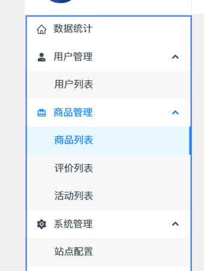

左侧的菜单
参考下面的图片

需要做6个部分的界面
1. 数据统计页面
2. 用户管理
3. 商品管理
4. 评价管理
5. 活动管理
6. 站点配置

每个页面是独立的，可以开多个子任务同时去运行
每个任务做完，就提交git， 提交信息需要中文

后端已经运行起来了在 127.0.0.1:8080
后端项目地址在 F:\IT\fengfeng\fengfeng_mall\fm_server
如果接口报错，可以通过日志排查问题